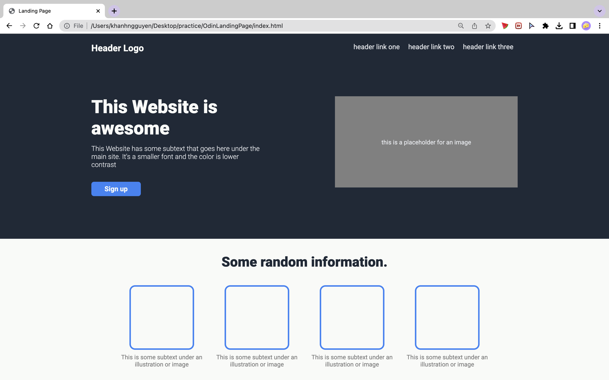
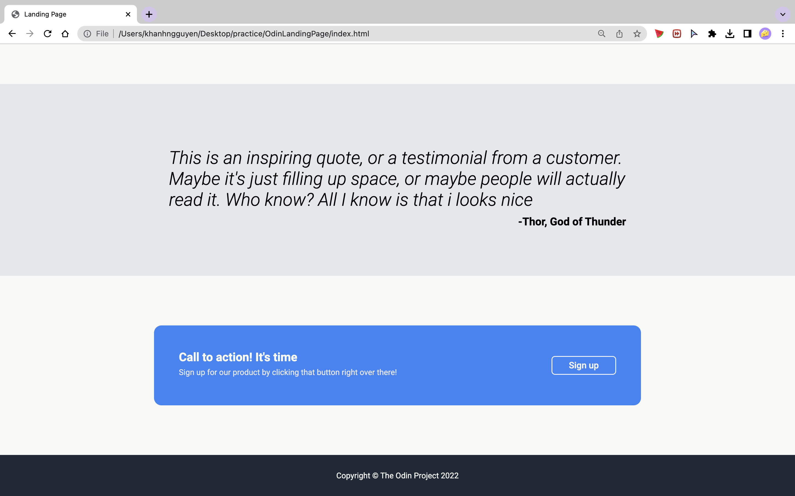

## Odin Landing Page
Project: Landing Page

### Project brief
Create a landing page using HTML & CSS as an assignment from TheOdinProject

Design Image of how the page is supposed to look like:

Color and Fonts instructions:

More details: [Detailed descriptions](https://www.theodinproject.com/lessons/foundations-landing-page#setting-up-your-projects-github-repository)

### Outcomes

*Screenshots of page at zoom level 90%*

